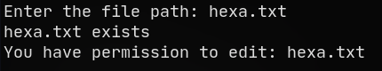
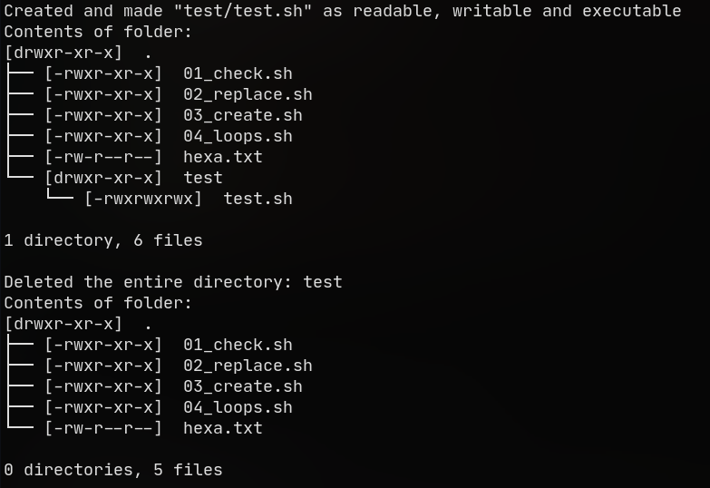

This repository is to document my learnings and progress towards AUV-Society.

**Table of Contents**
- [Intro](#intro)
- [Session 0](#session-0)
  - [Git](#git)
  - [Markdown](#markdown)
- [Session 1](#session-1)
  - [Question 1](#question-1)
  - [Question 2](#question-2)
  - [Question 3](#question-3)
  - [Question 4](#question-4)
- [Final Task](#final-task)
  - [Chat Bot](#chat-bot)
  - [Detect Gate](#detect-gate)

## Intro
- I previously knew programming in **Python** and **C**. I have also written many [python scripts](https://github.com/abhishekmj303/Virtual-Assistant) to automate things in my computer.
- I had a basic knowledge of **Git** and **Github**, which I used in some projects.
- I had become full time **Linux** user since the beginning of 1st year.
- I had also learnt the working of **Docker** along with docker-compose files by hosting some OpenSource projects in my own server.
- Recently, I started learning **Bash Scripting** for linux and wrote a [installation script](https://github.com/abhishekmj303/LogiNetwork/blob/master/linux/install.sh) for one of my recent project.

## Session 0
### Git
Since I have previously used **Git** and knew the basic commands I watched,
  1. [_Git for Professionals Tutorial_](https://www.youtube.com/watch?v=Uszj_k0DGsg) and [_Advanced Git Tutorial_](https://www.youtube.com/watch?v=qsTthZi23VE) by **FreeCodeCamp**. And learnt about,
     - The Perfect Commit
     - Branching Strategies
     - Pull Requests
     - Merge Conflicts
     - Rebase vs. Merge
     - Interactive Rebase
     - Cherry-Picking
     - Reflog
     - Submodules
     - Search & Find in Git
  2. [_Git Internals - CS50 Talks_](https://www.youtube.com/watch?v=lG90LZotrpo) by **CS50**. And learnt,
     - How Git works under the hood.
     - How everything is stored as hashes.
     - Git Objects - Blobs, Trees, Commits
     - How every commit is linked to previous commit.

### Markdown
I learnt Markdown by watching [some videos](https://www.youtube.com/watch?v=HUBNt18RFbo),
- Heading Levels
- Horizontal Rules
- Bold, Italic, Strikethrough, etc
- Blockquotes
- Links
- Images
- Lists
- Tables
- Code Blocks
- Using Variables

I have also written some README.md and TODO.md files for my own projects.

## Session 1
### Question 1
> Write a shell script to check to see if a file_path exists. If it does exist, display it on the terminal, that file_path exists. Next, check to see if the file is writable. If the file is writable, display, You have permission to edit the file:-file_path. If you cannot, display, You do NOT have permission to edit the file:- file_path

Output:

### Question 2
> Replace all occurrences of 0xA0 with 0x50 and 0xFF with 0x7F for the given input file.
Input File:- hexa.txt

Output:

### Question 3
> Write a bash script that makes a folder containing a file with read, write, execute access and then delete the entire folder.

Output:

### Question 4
> Write down an example and execute for all the loops in Shell Scripting.

Output:

## Final Task

### Chat Bot
> Create a ROS Package called “chat_bot” which contains a conversation between two users (say A and B)

Chat interface for A | Chat interface for B
:---: | :---:
 | 

### Detect Gate
> Write an algorithm to detect the gate in the [given video](comp_vision/6.m4v). Detection should not involve any Machine Learning or Deep Learning.

